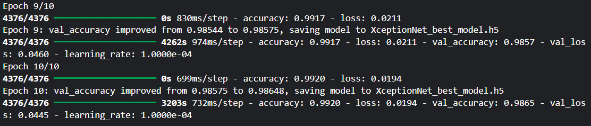
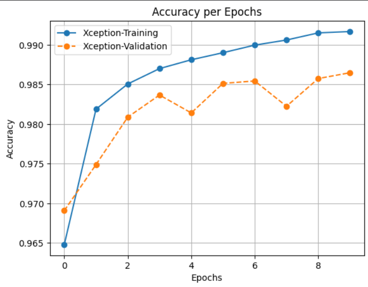
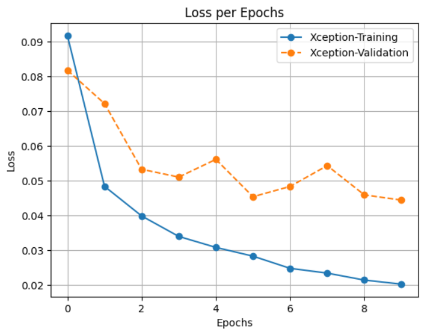
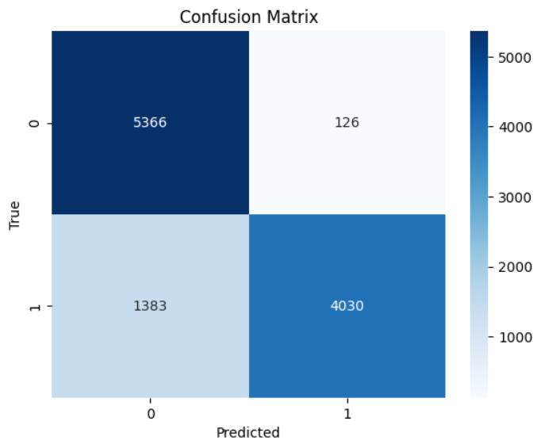
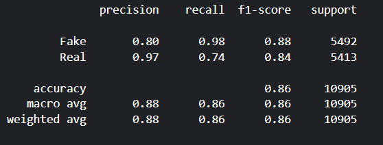
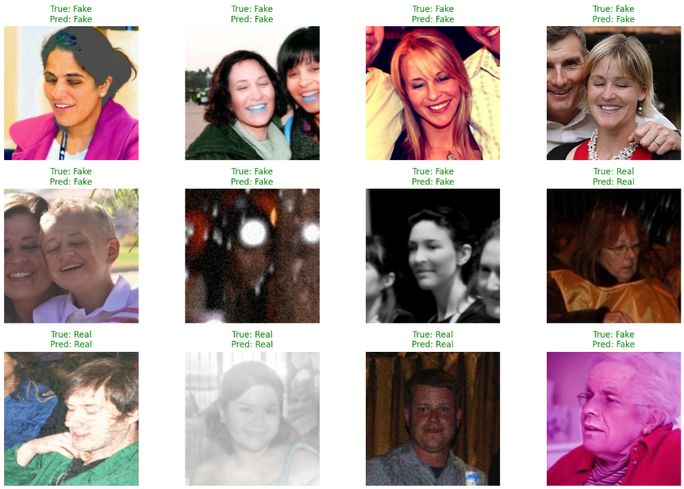

# 🕵️ DeepFake vs Real Image Classification with XceptionNet

## 📌 Overview
This project implements a **binary image classification model** to distinguish between **Real and Fake (DeepFake) images** using **XceptionNet** with transfer learning.  
The goal is to provide a reliable detection system that can be extended into real-world applications such as content verification and digital forensics.  

## 📂 Dataset

Source: [DeepFake and Real Images Dataset on Kaggle](https://www.kaggle.com/datasets/manjilkarki/deepfake-and-real-images).

The dataset is structured as follows:
  - **Train set:** Used for model training (with augmentation).  
  - **Validation set:** Used for hyperparameter tuning and early stopping.  
  - **Test set:** Used for final evaluation.

## ⚙️ Methodology

### 1. **Data Preprocessing & Augmentation**
- Images resized to **256 × 256**.  
- Augmentation techniques:
  - Rotation (±20°)  
  - Width/Height shift (20%)  
  - Shear (15%)  
  - Zoom (20%)  
  - Horizontal flip  
  - Brightness variation (0.8–1.2)  

### 2. **Model Architecture**
- **Base Model:** XceptionNet (pretrained on ImageNet).  
- **Custom classification head:**
  - Global Average Pooling  
  - Dense (512, ReLU)  
  - Batch Normalization  
  - Dropout (0.3)  
  - Dense (1, Sigmoid)
 
### 3. **Training Strategy**
- Optimizer: `Adam (lr=1e-4)`  
- Loss: `Binary Crossentropy`  
- Metrics: `Accuracy`  
- Callbacks:
  - **EarlyStopping:** patience = 5  
  - **ReduceLROnPlateau:** factor = 0.3  
  - **ModelCheckpoint:** save best model (`XceptionNet_best_model.h5`)  

## 📊 Results

### 1. Training 
  - Training accuracy: ~99.20%
  - Validation accuracy: ~98.65%
  - Loss: ~0.0445 (val)

    
**Loss and accuracy evolution over epochs.**  
| Accuracy | Loss |
|------------|------------|
|  |  |

### 2. Model Evaluation
- Test Accuracy: ~86.16%  
- Test Loss: ~1.289 

### 3. Confusion Matrix 

### 4. Classification Report

### 5. Prediction Visualization
Random test samples with True vs Predicted labels highlighted:  
- ✅ Correct predictions in **green**  
- ❌ Wrong predictions in **red**

## 📌 Future Work

- Extend model for multi-class classification (e.g., different types of fakes).
- Deploy as an API with FastAPI/Flask.
- Add Grad-CAM visualization for explainable AI.
- Experiment with other architectures (EfficientNet, ConvNeXt).
